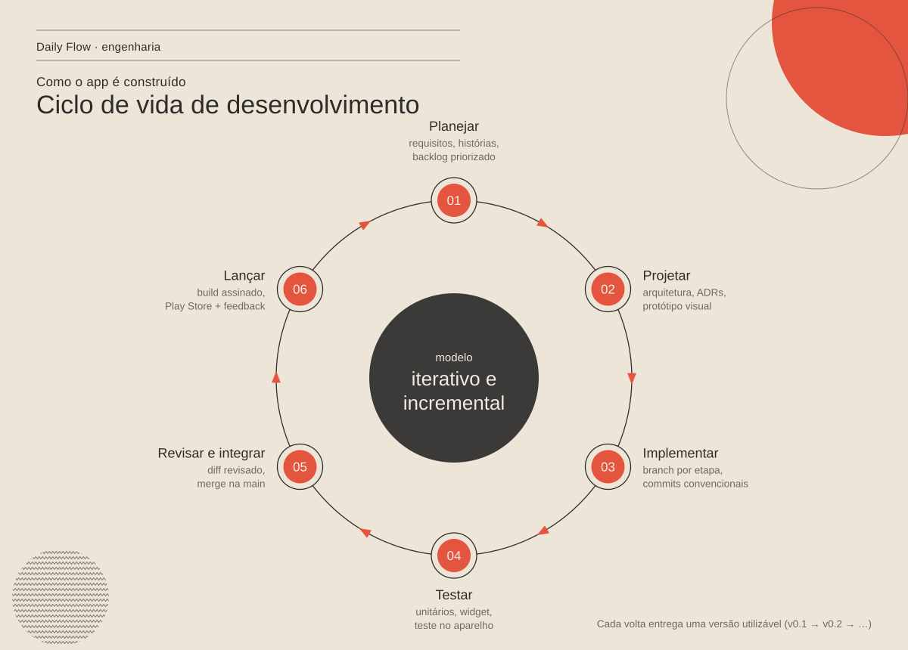

# Documentação do Daily Flow

## Produto
- [PRD — requisitos do produto](PRD.md)
- Funcionalidades: [Hoje](dashboard.md) · [Hábitos](habitos.md) ·
  [Tarefas](to-do.md) · [Foco](pomodoro.md) · [Estatísticas](estatistica.md)
- [Design visual](design.md)

## Engenharia
- [Arquitetura](arquitetura.md) — camadas, dependências, fluxo de dados, persistência
- [Decisões de arquitetura (ADRs)](adr/README.md)
- [Estratégia de testes](qualidade/testes.md)

## Processo
- [Ciclo de vida de desenvolvimento](processo/ciclo-de-vida.md) — modelo,
  branches, commits, versionamento, critérios de pronto, release
- [Refatoração por etapas](refatoracao/README.md) —
  [revisão de arquitetura](refatoracao/revisao-de-arquitetura.md) ·
  [etapa 1](refatoracao/etapa-1-fundacao.md)

## Imagens
Os diagramas em `assets/` são SVG gerados a partir de código, no estilo
editorial do app. Diagramas em Mermaid ficam dentro dos próprios documentos
e são renderizados pelo GitHub.
