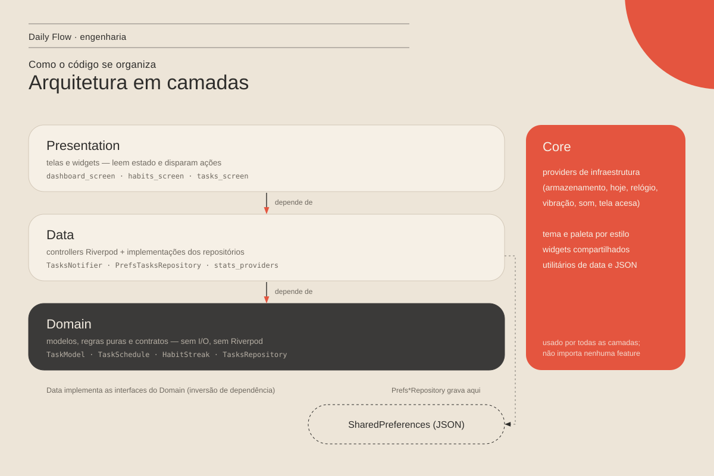
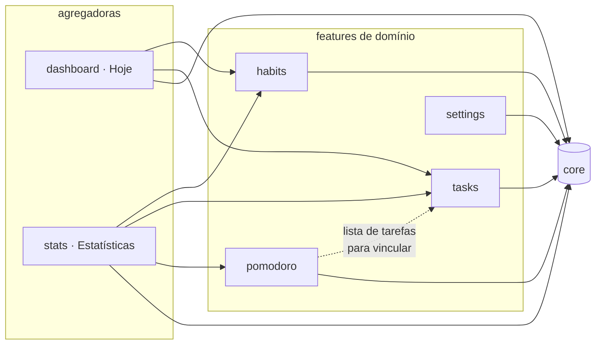
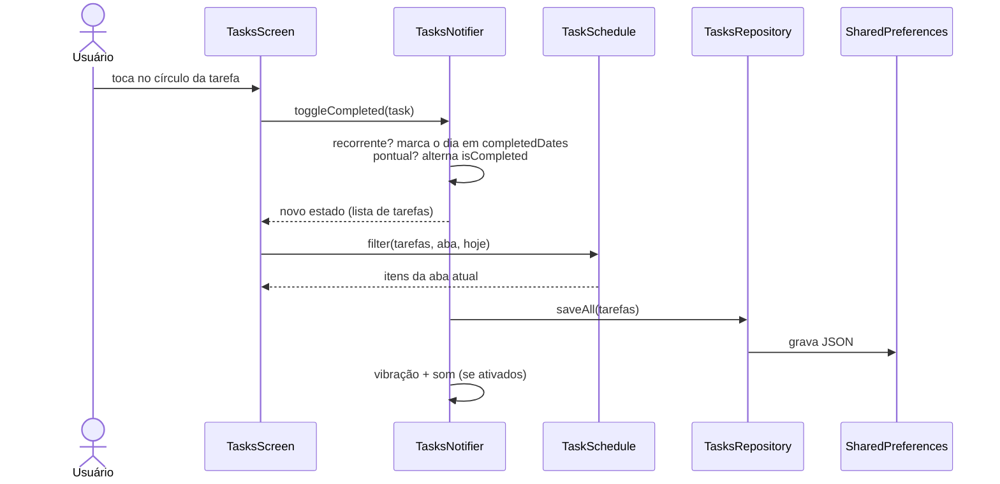

# Arquitetura — Daily Flow

> Como o código está organizado **hoje**, por quê, e as regras que mantêm
> essa organização. As decisões estão registradas em [`adr/`](adr/README.md).
> Histórico das mudanças: [refatoração — etapa 1](refatoracao/etapa-1-fundacao.md).



## 1. Visão geral

O Daily Flow é um app **Flutter offline-first**: tudo roda no aparelho, sem
servidor. A organização combina duas ideias:

- **Por feature (vertical):** cada funcionalidade — hábitos, tarefas, foco,
  estatísticas, configurações, Hoje — vive na sua pasta em `lib/features/`.
- **Em camadas (horizontal):** dentro de cada feature, o código se divide em
  `presentation/`, `data/` e `domain/`, com dependência sempre "para dentro".

| Camada | O que tem | Pode depender de | Não pode depender de |
| --- | --- | --- | --- |
| `presentation/` | Telas, widgets, diálogos | `data/`, `domain/`, `core/` | — |
| `data/` | Controllers (Riverpod `Notifier`) e implementações de repositório | `domain/`, `core/` | `presentation/` |
| `domain/` | Modelos imutáveis, regras puras, contratos de repositório | `core/utils` | `data/`, `presentation/`, Riverpod, armazenamento |
| `core/` | Providers de infraestrutura, serviços, tema, widgets e utilitários compartilhados | — | qualquer feature |

## 2. Estrutura de pastas

```text
lib/
├── main.dart              # composition root: abre o armazenamento e liga as dependências
├── app.dart               # MaterialApp + tema por estilo visual
├── routing/app_router.dart
├── core/
│   ├── constants/         # AppColors (paleta por estilo), AppStyle, AppTheme
│   ├── database/          # PrefsStore (wrapper do SharedPreferences) + chaves
│   ├── providers/         # prefsStore, today, haptics, sound, FeedbackPreferences
│   ├── services/          # HapticsService, SoundService
│   ├── utils/             # date_only, date_formatters, json_coders
│   └── widgets/           # AppShell, nav bar, cards, cabeçalho, fundo
└── features/
    ├── habits/            # domain: HabitModel, HabitStreak, HabitCalendar, HabitsRepository
    ├── tasks/             # domain: TaskModel, TaskSchedule, TasksRepository
    ├── pomodoro/          # domain: PomodoroSessionModel, PomodoroSessionsRepository
    ├── settings/          # domain: AppSettings, SettingsRepository
    ├── stats/             # domain: StatsCalculator  (feature agregadora)
    └── dashboard/         # tela Hoje                 (feature agregadora)
```

## 3. Dependências entre features

Features **de domínio** (hábitos, tarefas, foco, configurações) não importam
umas às outras. Duas features são **agregadoras** e podem *ler* as outras,
porque existem justamente para juntar dados: a tela **Hoje** e as
**Estatísticas** ([ADR 0002](adr/0002-providers-em-core.md)).



> Antes da etapa 1 havia um ciclo `settings → habits → settings` e três
> features importavam `habits` só para acessar o armazenamento. Ver o
> [antes e depois](refatoracao/etapa-1-fundacao.md#1-dependências).

## 4. Fluxo de dados (exemplo: concluir uma tarefa)

O estado vive em `Notifier`s do Riverpod. A tela nunca grava nada direto: ela
chama o controller, que atualiza o estado em memória (a UI reage na hora) e
persiste pelo **contrato** do repositório.



## 5. Composition root e injeção de dependência

`main.dart` é o único lugar que conhece as implementações concretas:

```dart
ProviderScope(
  overrides: [
    prefsStoreProvider.overrideWithValue(store),          // armazenamento aberto
    feedbackPreferencesProvider.overrideWith((ref) {      // core ← configurações
      final s = ref.watch(settingsProvider);
      return FeedbackPreferences(haptics: s.hapticsEnabled, sound: s.soundEnabled);
    }),
  ],
  child: const DailyFlowApp(),
)
```

Cada feature expõe o repositório por um provider tipado com a **interface**
(`Provider<TasksRepository>`). Nos testes, ele é trocado por um repositório em
memória sem mudar uma linha do controller.

## 6. Persistência

| Chave (`SharedPreferences`) | Conteúdo | Repositório |
| --- | --- | --- |
| `daily_flow.habits` | lista JSON de `HabitModel` | `PrefsHabitsRepository` |
| `daily_flow.tasks` | lista JSON de `TaskModel` | `PrefsTasksRepository` |
| `daily_flow.pomodoro_sessions` | lista JSON de `PomodoroSessionModel` | `PrefsPomodoroSessionsRepository` |
| `daily_flow.settings` | objeto JSON de `AppSettings` | `PrefsSettingsRepository` |

- Leitura síncrona: o `PrefsStore` é aberto antes do `runApp`, então os dados
  já estão em memória ([ADR 0003](adr/0003-repositorios.md)).
- Registros corrompidos são descartados um a um (`JsonCoders.decodeList`), sem
  derrubar o app.
- Migrações de formato ficam no `fromJson` de cada modelo (ex.: tarefas
  recorrentes antigas → `completedDates`).

## 7. Regras de negócio no domínio

| Regra | Onde | Testes |
| --- | --- | --- |
| O que é "de hoje", o que está feito, conteúdo das abas | `tasks/domain/task_schedule.dart` | `test/features/tasks/task_schedule_test.dart` |
| Sequência (streak) de hábitos | `habits/domain/habit_rules.dart` (`HabitStreak`) | `test/features/habits/habit_rules_test.dart` |
| Dias incompletos do calendário | `habits/domain/habit_rules.dart` (`HabitCalendar`) | idem |
| Agregações das estatísticas | `stats/domain/stats_calculator.dart` | `test/features/stats/stats_calculator_test.dart` |

São funções puras: recebem dados e a data de hoje, devolvem resultados. "Hoje"
vem do `todayProvider` (recalculado à meia-noite), nunca de `DateTime.now()`
espalhado pelo código ([ADR 0004](adr/0004-regras-de-dominio-puras.md)).

## 8. Interface e estilos visuais

Dois estilos selecionáveis em Configurações — **Editorial** (padrão) e
**Liquid Glass** — com paleta em `AppPalette` e tema em `AppTheme.build`
([ADR 0005](adr/0005-dois-estilos-visuais.md)). Detalhes visuais em
[`design.md`](design.md).

## 9. Dívidas conhecidas (próximas etapas)

- `AppColors` é estado global estático; o caminho certo é `ThemeExtension`.
- Telas grandes (`habits_screen.dart`, `settings_screen.dart`, `tasks_screen.dart`)
  precisam ser quebradas em widgets menores.
- Timer de foco conta "de 1 em 1 segundo" e para em segundo plano; deve
  calcular a partir do horário de término.
- Dependências não usadas no `pubspec.yaml` (`wakelock_plus`,
  `flutter_local_notifications`, `vibration`).
- Testes de widget e de integração; CI no GitHub Actions.
