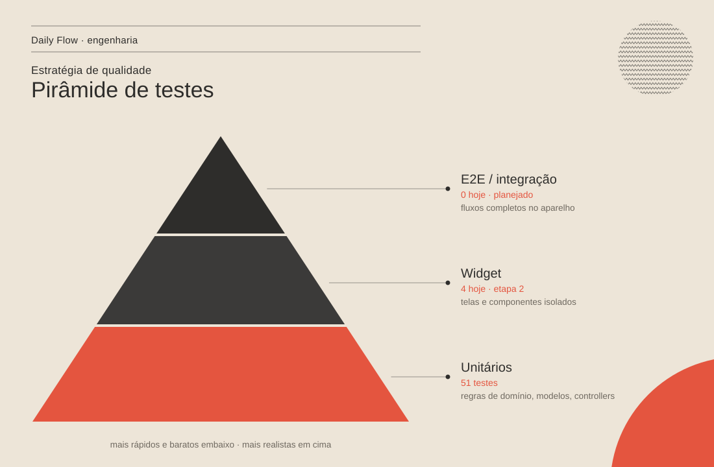

# Estratégia de testes

> O que é testado, como, e por quê. Os testes protegem principalmente as
> **regras de negócio** — é onde moram os bugs que o usuário sente (tarefa
> que não volta, sequência errada, gráfico zerado).



## 1. Pirâmide

| Nível | O que cobre | Velocidade | Hoje | Meta |
| --- | --- | --- | --- | --- |
| **Unitário** | Regras puras do domínio, modelos (JSON e migração), controllers com repositório em memória | milissegundos | 35 | toda regra nova e todo bug corrigido |
| **Widget** | Uma tela ou componente isolado, com providers sobrescritos | rápido | 1 (smoke) | telas principais nos dois estilos — etapa 2 |
| **Integração / E2E** | Fluxos completos no aparelho ou emulador | lento | 0 | 3 fluxos críticos — etapa 2 |

A base larga é intencional: as regras foram extraídas para funções puras
([ADR 0004](../adr/0004-regras-de-dominio-puras.md)) justamente para serem
testadas sem montar interface.

## 2. O que está coberto

| Arquivo | Testes | Protege |
| --- | --- | --- |
| `test/features/tasks/task_schedule_test.dart` | 12 | "é de hoje", conteúdo de cada aba, painel Hoje, contador de pendentes |
| `test/features/tasks/task_model_test.dart` | 3 | JSON ida e volta; **migração** de recorrentes antigas |
| `test/features/tasks/tasks_controller_test.dart` | 4 | Concluir/desfazer recorrente por dia, persistência via repositório |
| `test/features/habits/habit_rules_test.dart` | 9 | Sequência (dias previstos, quebra, hoje em aberto), dias incompletos |
| `test/features/stats/stats_calculator_test.dart` | 4 | Contagem de conclusões, gráfico semanal e anual, minutos de foco |
| `test/core/json_coders_test.dart` | 3 | Registros corrompidos não derrubam o app |
| `test/widget_test.dart` | 1 | Smoke (a substituir na etapa 2) |

**Testes de regressão:** cada bug corrigido na etapa 1 tem um teste com o
cenário que falhava — por exemplo `gráfico anual soma o mês inteiro (bug
antigo: só o mesmo dia)` e `recorrente feita na terça volta a ficar pendente
na quinta`.

## 3. Convenções

- **Nomes em português, descrevendo o comportamento**, não o método:
  `hoje ainda não feito não quebra a sequência`.
- **Arrange · Act · Assert**: monta os dados, executa uma ação, verifica.
- **Datas fixas.** Nada de `DateTime.now()` em teste. As regras recebem "hoje"
  como parâmetro e o controller lê do `todayProvider`, sobrescrito com
  `thu` (quinta, 01/10/2026) — ver `test/helpers/fixtures.dart`.
- **Fakes em vez de mocks.** Repositório em memória
  (`InMemoryTasksRepository`), som silencioso (`SilentSound`). Sem bibliotecas
  de mock: os contratos são pequenos e o fake fica legível.
- **Fábricas de dados** (`task(...)`, `habit(...)`) com valores padrão;
  cada teste só informa o que importa para ele.
- **Um bug, um teste.** Correção de bug entra junto com o teste que o reproduz.

## 4. Como rodar

```powershell
cd gestao_pessoal
flutter test                     # todos
flutter test test/features/tasks # uma pasta
flutter test --coverage          # gera coverage/lcov.info
```

Para ver a cobertura em HTML (precisa do `lcov`/`genhtml`):

```bash
genhtml coverage/lcov.info -o coverage/html
```

## 5. Próximos passos (etapa 2)

**Testes de widget**
- Tela Hoje: progresso "03 / 07" e item riscado ao concluir.
- Tarefas: troca de abas e estado vazio de cada aba.
- Configurações: trocar de estilo recria a árvore com a nova paleta.

**Integração (`integration_test/`)**
1. Criar hábito → marcar → sequência aparece em Hábitos e Estatísticas.
2. Criar tarefa recorrente → concluir → some de "Hoje" → reaparece no próximo dia previsto.
3. Completar uma sessão de foco → minutos aparecem nas Estatísticas.

**Automação**
- GitHub Actions rodando `flutter analyze` e `flutter test` a cada push e
  pull request, com selo no README.
- Lints mais rígidos no `analysis_options.yaml` (ex.: `prefer_const_constructors`,
  `avoid_dynamic_calls`, `unawaited_futures`).
