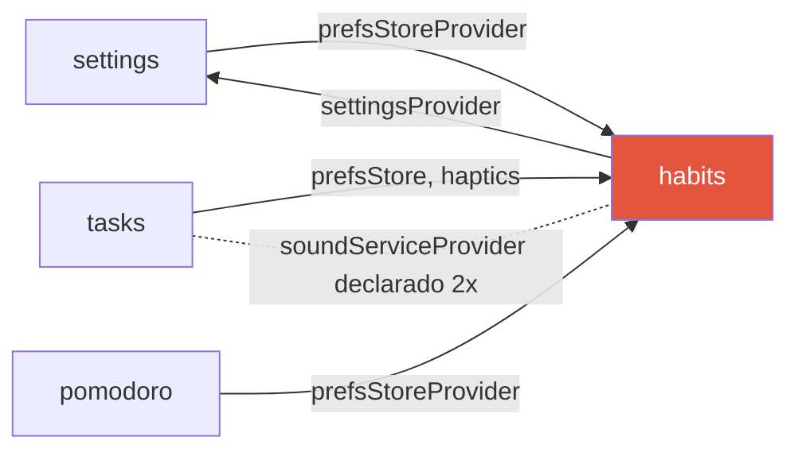
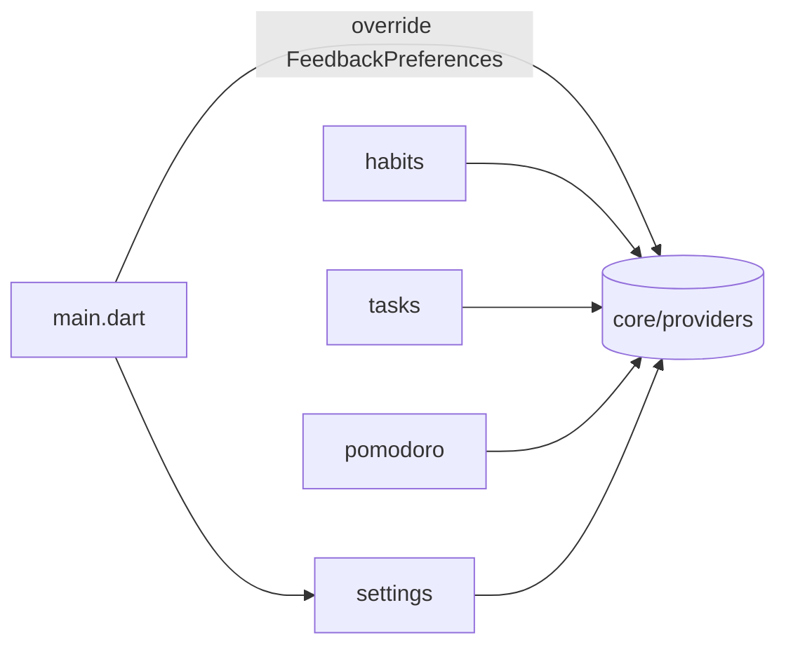
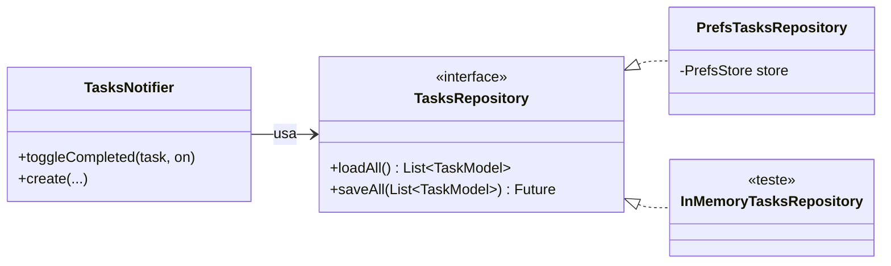

# Etapa 1 — Fundação

- **Branch:** `refactor/etapa-1-fundacao`
- **Objetivo:** corrigir as dependências, separar persistência e regras de
  negócio, e cobrir as regras com testes — sem mudar o visual.
- **Decisões:** [ADR 0002](../adr/0002-providers-em-core.md),
  [0003](../adr/0003-repositorios.md), [0004](../adr/0004-regras-de-dominio-puras.md)

## 1. Dependências

**Antes** — três features importavam `habits` só para chegar no
armazenamento, e havia um ciclo entre `settings` e `habits`:



**Depois** — infraestrutura em `core/`, ligada às configurações pelo
`main.dart` (composition root):



## 2. Persistência atrás de interfaces



O mesmo padrão vale para hábitos, configurações e sessões de foco.

## 3. Regras no domínio

| Antes | Depois |
| --- | --- |
| Tela Hoje filtrava tarefas por conta própria | `TaskSchedule.forDay` — mesma regra da aba Hoje |
| Abas filtradas no controller | `TaskSchedule.filter` (puro, testado) |
| `streakCount` gravado no JSON | `HabitStreak.current` calculado a partir das datas |
| Loop de 90 dias no `build` da tela de Hábitos | `HabitCalendar.incompleteDays` memoizado em provider |
| Contas no `build` das Estatísticas | `StatsCalculator.summarize` memoizado |

## 4. Bugs corrigidos

| Bug | Causa | Correção |
| --- | --- | --- |
| Tarefa recorrente ("Correr") ficava concluída para sempre | Um único `isCompleted` para todas as ocorrências | `TaskModel.completedDates`: uma conclusão por dia; migração automática dos dados antigos |
| Tarefas nunca contavam em "Feitos hoje" | Tela Hoje escondia as concluídas antes de contar | `TaskSchedule.forDay` inclui as feitas hoje |
| Hoje e a aba Hoje mostravam listas diferentes | Duas implementações da mesma regra | Fonte única em `TaskSchedule` |
| Sequência de hábitos não zerava | Valor gravado só mudava ao marcar/desmarcar | Calculada; considera só os dias previstos |
| Estatísticas não atualizavam após uma sessão de foco | Histórico lido uma vez | `PomodoroHistoryNotifier` reativo |
| Gráfico "Ano" quase zerado | Contava só o mesmo dia de cada mês | Soma o mês inteiro |
| App podia fechar com um registro corrompido | `fromJson` lançava exceção | Registro inválido é descartado |

## 5. Desempenho

| Causa de lentidão | Correção |
| --- | --- |
| `habitsForDayProvider(DateTime.now())`: chave com segundos → um provider novo a cada rebuild, nunca liberado (memória crescendo) | Chave estável (`todayProvider`) + `autoDispose` |
| Lista de marcadores do calendário recriada a cada build | Provider memoizado |
| 90 dias × hábitos × busca linear em `completedDates` a cada build | Conjuntos pré-computados, recalculados só quando os dados mudam |
| `SoundService` recriado sem liberar o `AudioPlayer` | `ref.onDispose(service.dispose)` |

> Lembrete: `flutter run` usa o modo **debug**, bem mais lento que o APK
> release. Medir desempenho sempre com `flutter run --profile` ou o release.

## 6. Commits da etapa

1. `refactor(core): providers de infraestrutura em core/ e fim da dependência circular`
2. `refactor(data): repositórios com interface para hábitos, tarefas, configurações e sessões`
3. `refactor(tasks): regras de agendamento no domínio + conclusão por dia nas recorrentes`
4. `refactor(habits,stats): sequência calculada, regras no domínio e cálculos memoizados`
5. `test: testes unitários das regras de domínio e do controller de tarefas`
6. `docs: arquitetura, ADRs, ciclo de vida, testes e registro da etapa 1`

## 7. Como verificar

```powershell
cd gestao_pessoal
flutter pub get
flutter analyze
flutter test
flutter run --profile
```

Roteiro manual:
1. Crie uma tarefa que se repete hoje, marque como feita → some de "Hoje",
   aparece riscada na tela Hoje e conta em "Feitos hoje".
2. No dia seguinte previsto, ela volta como pendente.
3. Conclua uma sessão de foco → Estatísticas mostram os minutos sem
   reiniciar o app.
4. Troque a aba de período para "Ano" → as barras somam o mês.
